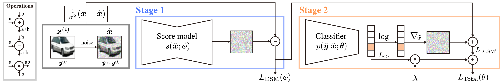

# Denoising Likelihood Score Matching for Conditional Score-based Data Generation

[](https://arxiv.org/abs/2203.14206)
[](https://www.youtube.com/watch?v=uO43ZxEAMRc)\
[](https://paperswithcode.com/sota/conditional-image-generation-on-cifar-10?p=denoising-likelihood-score-matching-for-1)
[](https://paperswithcode.com/sota/conditional-image-generation-on-cifar-100?p=denoising-likelihood-score-matching-for-1)

This repository includes the official code implementation for the paper [Denoising Likelihood Score Matching for Conditional Score-based Data Generation](https://openreview.net/forum?id=LcF-EEt8cCC&referrer=%5BAuthor%20Console%5D(%2Fgroup%3Fid%3DICLR.cc%2F2022%2FConference%2FAuthors%23your-submissions)).



The code implementation for the motivational example (the toy experiment) is in [chen-hao-chao/dlsm-toy](https://github.com/chen-hao-chao/dlsm-toy).

The project page is available at: <https://chen-hao-chao.github.io/dlsm/>

## Pretrained Weights
|Model | Dataset | Checkpoint | 
| --- | ------- | ---------- |
| Classifier | Cifar-10 | [Cifar10/ours/checkpoint.pth](https://drive.google.com/file/d/1BLewrKYoHZNinQHxA16NW4CyUScaYf1g/view?usp=drive_link) |
| Classifier | Cifar-10 | [Cifar10/base/checkpoint.pth](https://drive.google.com/file/d/1-5vHN-JLL4PviaWKHyL__FmadbgNjhLu/view?usp=drive_link) |
| Classifier | Cifar-100 | [Cifar100/ours/checkpoint.pth](https://drive.google.com/file/d/1gxpggh1QPVIrvtMVhFu03xUvbRHfFeCf/view?usp=drive_link) |
| Classifier | Cifar-100 | [Cifar100/base/checkpoint.pth](https://drive.google.com/file/d/1fpywbC_yx8MbDYxKRWBeXRcJM1ER4ZaI/view?usp=drive_link) |
| Score Model | Cifar-10 | [Cifar10/score/checkpoint.pth](https://drive.google.com/file/d/16LBqL_44yLurwTLZAZAm9OdN2UpbHCPM/view?usp=drive_link) |
| Score Model | Cifar-100 | [Cifar100/score/checkpoint.pth](https://drive.google.com/file/d/1k2LKzvs0LA61q3BjHNSESBitOOacf5Fs/view?usp=drive_link) |

## Dependencies
Install the necessary python packages through the following command.
```
pip3 install -r requirements.txt
```
## Training and Evaluation Procedure
Please follow the below procedure to reproduce this work:

**Training:** (1) Train a score model. (2) Load the pretrained score model and train a classifier.

**Evaluation:** (3) Sample data points using `run_lib_sampling.py`. (4) Evaluate the performance using `run_lib_evaluation.py` and `run_lib_CAS.py`.

The details about these training and evaluation procedures are elaborated below.

### Usage

**Train score models**

Use the following command to train a score model with default setting on the Cifar-10 dataset:
```
python3 main.py --config configs/score/cifar10_score_configs.py --model score --workdir score_cifar10
```
Use the following command to train a score model with default setting on the Cifar-100 dataset:
```
python3 main.py --config configs/score/cifar100_score_configs.py --model score --workdir score_cifar100
```

**Train classifiers**

Use the following command to train a classifier with default setting on the Cifar-10 dataset:
```
python3 main.py --config configs/classifier/cifar10_classifier_resnet18_cond_configs.py --model classifier --workdir classifier_cifar10_ours_resnet18_cond
```
Use the following command to train a classifier with default setting on the Cifar-100 dataset:
```
python3 main.py --config configs/classifier/cifar100_classifier_resnet34_cond_configs.py --model classifier --workdir classifier_cifar100_ours_resnet34_cond 
```
Please make sure that the pretrained score model is placed at `sampling.score_restore_path` specified in the configuration file for the above two settings. It is also possible to add an additional argument `--restore {PATH_TO_SCORE_CHECKPOINT}` to identify `sampling.score_restore_path`. For example, the following command describes the training procedure of DLSM with the score model placed at `results/score_cifar10/checkpoints/checkpoint.pth`:
```
python3 main.py --config configs/classifier/cifar10_classifier_resnet18_cond_configs.py --model classifier --workdir classifier_cifar10_ours_resnet18_cond --restore results/score_cifar10/checkpoints/checkpoint.pth
```

**Sampling (`run_lib_sampling.py`)**

Sampling with default setting with models pretrained on the Cifar-10 dataset:
```
python3 run_lib_sampling.py --config configs/eval/cifar10/eval_cifar10_configs.py --mode full --workdir classifier_cifar10_ours_resnet18_cond
```
Sampling with scaling factor 10:
```
python3 run_lib_sampling.py --config configs/eval/cifar10/eval_cifar10_configs.py --mode full --workdir classifier_cifar10_ours_resnet18_cond --scale 10
```
Sampling class-wisely with class index from 5 (inclusive) to 7 (exclusive):
```
python3 run_lib_sampling.py --config configs/eval/cifar10/eval_cifar10_configs.py --mode class --classid 5 --classidend 7 --workdir classifier_cifar10_ours_resnet18_cond
```
Sampling with default setting using models pretrained on the Cifar-100 dataset:
```
python3 run_lib_sampling.py --config configs/eval/cifar100/eval_cifar100_configs.py --mode full --workdir classifier_cifar100_ours_resnet34_cond
```
Please make sure that the pretrained score model and classifier are placed at `model.score_restore_path` and `model.classifier_restore_path` specified in the configuration file and the arguments in `main.py` for the above settings. It is also possible to add additional arguments `--restore {PATH_TO_SCORE_CHECKPOINT}` and `--restore_classifier {PATH_TO_CLASSIFIER_CHECKPOINT}` to identify `model.score_restore_path` and `model.classifier_restore_path`. For example, the following command describes the sampling procedure with a pretrained score model and a pretrained classifier.
```
python3 run_lib_sampling.py --config configs/eval/cifar10/eval_cifar10_configs.py --mode full --workdir classifier_cifar10_ours_resnet18_cond --restore results/score_cifar10/checkpoints/checkpoint.pth --restore results/classifier_cifar100_ours_resnet34_cond/checkpoints/checkpoint.pth
```

**Evaluatation (`run_lib_evaluation.py`)**

Examine the sampling quality (FID/IS/PRDC) with default setting:
```
python3 run_lib_evaluation.py --config configs/eval/cifar10/eval_cifar10_configs.py --workdir classifier_cifar10_ours_resnet18_cond --stat --latent --fidis --prdc --mode full 
```
- The flag `stat` indicates whether to create stats files. If it is set to True, the images from a dataset will be stacked class-wisely and the resulting vector will be saved in `{WORKDIR}/stat/stat.pnz`.
- The flag `latent` indicates whether to create latent files. If it is set to True, the data vector stored in `{WORKDIR}/stat/stat.pnz` will be encoded as latents and saved in `{WORKDIR}/stat/stat.pnz`. Meanwhile, the generated samples will also be encoded as latents and saved.
- The flag `fidis` indicates whether to calculate the FID / IS metrics. If it is set to True, the FID / IS metrics will be calculated and reported.
- The flag `prdc` indicates whether to calculate the P / R / D / C metrics. If it is set to True, the P / R / D / C metrics will be calculated and reported.
- The flag `mode` indicates the evaluation mode, which can be `full` or `class`. If it is set to `full`, the metrics will be calculated unconditionally. If it is set to `class`, the metrics will be calculated conditionally, i.e., the CW metrics in our paper.

**Evaluatation (`run_lib_evaluation_cas.py`)**

Examine the sampling quality (CAS) with default setting:
```
python3 run_lib_evaluation_cas.py --config configs/eval/cifar10/eval_cifar10_configs_cas.py --workdir classifier_cifar10_ours_resnet18_cond --setup ours
```
Please make sure the generated samples are placed at `{WORKDIR}/results/classifier_cifar10_{SETUP}_resnet18_cond/sample` for Cifar-10, and `{WORKDIR}/results/classifier_cifar100_{SETUP}_resnet34_cond/sample` for Cifar-100. It is also possible to change the paths specified in `samples/samples`, i.e., `SAMPLES_DIR_BASE`, `SAMPLES_DIR_OURS`, `SAMPLES_DIR_SCALE`.

## Citing DLSM
If you find this code useful, please consider citing our paper.
```bib
@inproceedings{
  chao2022denoising,
  title={Denoising Likelihood Score Matching for Conditional Score-based Data Generation},
  author={Chen-Hao Chao and Wei-Fang Sun and Bo-Wun Cheng and Yi-Chen Lo and Chia-Che Chang and Yu-Lun Liu and Yu-Lin Chang and Chia-Ping Chen and Chun-Yi Lee},
  booktitle={International Conference on Learning Representations},
  year={2022},
  url={https://openreview.net/forum?id=LcF-EEt8cCC}
}
```

## License

To maintain reproducibility, we freezed the following repository and list its license below:
- [yang-song/score_sde_pytorch](https://github.com/yang-song/score_sde_pytorch) (at commit 1618dde) is licensed under the [Apache-2.0 License](https://github.com/yang-song/score_sde_pytorch/blob/main/LICENSE)

Further changes based on the repository above are licensed under the [Apache-2.0 License](LICENSE).
